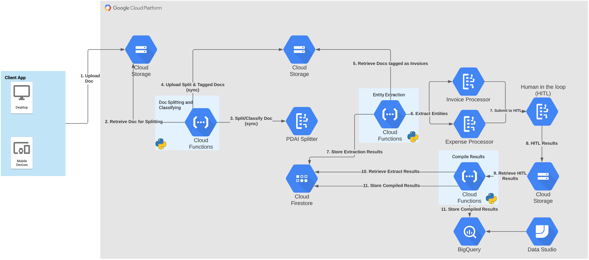
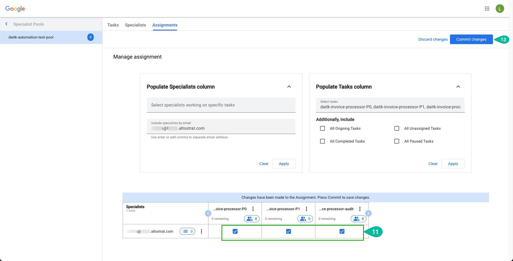
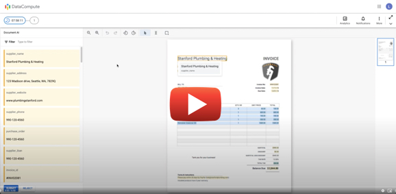

# Document AI Toolkit

## Quick Links

- [Deployment & Configuration](#deployment-steps)
  - [Automated Deployment](#automated-deployment)
  - [Manual Deployment](#manual-deployment)
- [Execute Invoice Entity Extraction](#extract-invoice-entities)
- [Execute Extraction Review](#review-extraction-results)

## Overview

The following will outline steps to setup a document processing pipeline and will provide the following functional capabilities.

- Ingest Document into Cloud Storage Bucket
- Split & Classify multiple page documents
- Convert file formates (JPEG, PNG, TIFF, GIF) to supported Document AI format (PDF)
- Store entity extraction results in Google Cloud Firestore as a json document
- Store raw extraction results in Google Cloud Storage
- Trigger Human-in-the-loop review of document to establish ground truth
- Store merged results of Human-in-the-loop review and entitiy extraction in Cloud Firestore

## Requirements

Access to current GA PDAI processor is available via allowlist. If you have not completed the request to have your project allowlisted then please complete the linked form - [Document AI Request Form](https://docs.google.com/forms/d/e/1FAIpQLSc_6s8jsHLZWWE0aSX0bdmk24XDoPiE_oq5enDApLcp1VKJ-Q/viewform?gxids=7826). You will receive a confirmation email once your allowlist request has been completed and then you can proceed on with the following steps.

## Limits

- Pipeline currently utilizes online/synchronous APIs which has the following limitations.
  - PDAI Splitter / Classifier - 15 Pages or 1Gb
  - Invoice Processor - 10 Pages or 20Mb
  - Expense Processor - 10 Pages or 20Mb

## Technology Overview

The following Google Cloud services are utilized for this pipeline.

- Google Cloud Storage
- Google Cloud Functions
- Google Cloud Firestore
- Google Cloud Document AI
- Google Cloud Big Query
- Data Studio

## Deployment Steps

It is recommended to create a new GCP Project to install the DocumentAI-Toolkit as the installation instructions a writtin from that perspective.
### Automated Deployment

1. Create new GCP project - [Guide](https://cloud.google.com/resource-manager/docs/creating-managing-projects#creating_a_project)
2. Within the GCP Console, select your new project and launch CloudShell. [Guide](https://cloud.google.com/shell/docs/launching-cloud-shell#launching_from_the)
3. Execute the following commands in CloudShell to create and change to your new directory.
~~~bash
mkdir daitk
cd daitk
~~~
4. Clone this github repo.
>IMPORTANT - Currently this repo is set to private and will require an access token to execute the following command. If prompted for credentials please follow the following [link](https://github.com/settings/tokens/new) to generate a Github personal access token and use that token inplace of your password when prompted. 
~~~bash
git clone https://github.com/hoogman/documentai-toolkit.git
~~~
5. Enable the DocumentAI API
~~~
gcloud services enable documentai.googleapis.com
~~~
6. If not already completed please complete the DocumentAI Processor allowlist form to enable deployment of the PDAI Splitter processor. [Request Form](https://docs.google.com/forms/d/e/1FAIpQLSc_6s8jsHLZWWE0aSX0bdmk24XDoPiE_oq5enDApLcp1VKJ-Q/viewform?gxids=7826)
>Do not proceed to next step until you have received notification that your allowlisting has been approved.
7. Execute the following commands to install toolkit. The installer.sh script will prompt your for 4 pieces of information 
- GCP Project ID 
- GCP Project Number
- Location - (us or eu) At this time only us location has been tested.
- Execution Method - (create or destroy)

~~~bash
cd documentai-toolkit
pip3 install -r scripts/utils/requirements.txt
chmod 711 installer.sh
./installer.sh
~~~
8. Currently Human-in-the-Loop configuration is a manual process. Please complete the following configuration steps to enable HITL for your newly created Invoice & Expense processors.

    1. Go to DocumentAI Processors page in GCP console - [Direct Link](https://console.cloud.google.com/ai/document-ai/processors)
    2. Click on the name of your newly created processor
    3. Select "Set Configuration" under Human Review.
    4. Select "Configure Human-in-the-Loop"
    5. Under Set Filters. Select the radio button next to "Label-level filters"
    6. At bottom of pop out find "Rows per page" and set dropdown to 100
    7. Check the box next to "Label Name" column to select all entities.
    8. Select "Edit Properties"
    9. Under Set Validation Criteria select radio button next to "Validate for human review"
    10. Under Occurance select radio button next to "Optional" 
    11. Move the "Confidence threshold %" slider to 100 and select save
    12. On pop out window select save.
    13. Under Select Specialists. Select Radio button next to "Use my own specialists"
    14. Select "Specialist pool" dropdown box -> Select "New Specialist Pool" if this is your first HITL configuration or select existing pool.
    15. In the New Specialist Pool Window enter a pool name of your choice. Under pool managers add your Google Identity used to login to GCP console. Select Save.
    16. On main configuration page under Confirm Charges select the checkbox.
    17. Under Instructions - Leave Blank
    18. Under Results select Browse. - Choose the GCS bucket named \<project-id\>-hitl-results and hit Select
    19. Select "Save Configuration"
    20. When configuration has completed select the "Enable Human-in-the-loop" toggle. When prompted selec "Enable"
    21. Repeate Steps for remaining DocumentAI processors.

9. Add Specialists to Specialist Pool
    1. Enter the HITL Management Interface - [Link](https://datacompute.google.com/cm)
    2. Click on the Specialists tab.
    3. Select Add Specialist
    4. Enter email address of document review specialist. This can be the same email you used for your pool manager.
    5. Select Add
    6. Select Add More if you wish to add additional review specialists else choose Close.
    7. Select Check boxes next to newly created specialists and select Manage assignment.
    8. Under "Populate Tasks column" click Select tasks box.
    9. Click checkboxes for all available tasks in list.
    10. Click Apply
    11. Select all task next to specialist name.
    12. Select Commit changes.
    
    13. Select Commit

10. You're now ready to begin processing documents.
### Manual Deployment

[Documentation](./docs/README.md)

## Extract Invoice & Expense Entities

1. Login to the Google Cloud Console.
2. Select the bucket labelled with the suffix "dai-upload".
3. Select Upload file or Upload folder to upload all documents within a folder.
4. Uploading to the GCS bucket will trigger the pipeline and execute the Entity extraction, document review, and will store extracted entities in Google Cloud Firestore as a json document and will store the raw json response from the invoice process to the bucket with the suffix "dai-raw-entity-extraction".

## Review Extraction Results

1. Enter specials workbench to complete document review - [Link](https://datacompute.google.com/w)
2. Extracted entities will appear in the left column and the document will be displayed in center column. If the document has multiple pages those will be identified as thumbnails on the right column.
3. Review all entities for accuracy. Correct any inaccuracte results.
4. When your review is completed select Submit.

### Human-in-the-loop Video Overview

